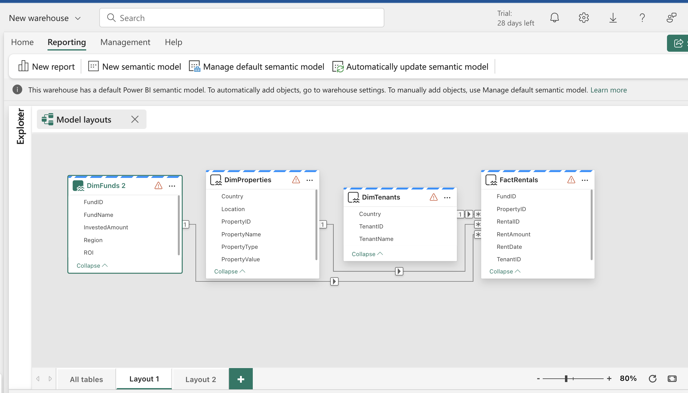
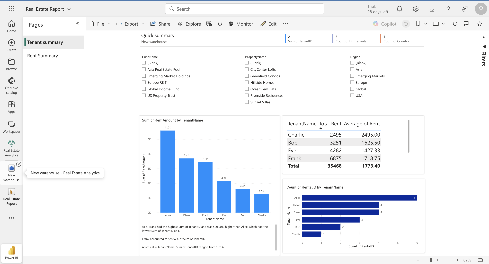
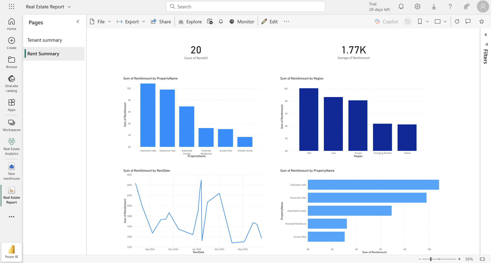

# 🏢 Real Estate Analytics – Power BI Dashboard Project

This Power BI project provides a dynamic, insightful dashboard for analyzing tenant activity and rental revenue in the real estate sector. Built from AI-generated data, it simulates the real-world needs of a property manager or investor.

---

## 📊 Project Overview

The report consists of **two interactive dashboards**:
- **Tenant Summary**: Gives detailed insight into tenants, their contributions, and lease activity.
- **Rent Summary**: Shows performance across properties and regions, helping with financial and operational analysis.

---

## 🧠 Business Value 
- **Tenant Summary**: Enables property managers to proactively monitor lease expirations and tenant status, supporting operational efficiency.
- **Rent Summary**: Equips property owners with revenue trends, offering quick access to delinquency risks and revenue forecasting.
- Visuals crafted to deliver decision-making clarity with minimal cognitive load—leveraging storytelling best practices (e.g., high-level metrics leading into trends) 

### 🎯 Why These Dashboards Matter:

**Real estate decision-makers** rely on clear, actionable data to:
- Monitor rent inflow and delinquency
- Identify top and underperforming properties
- Understand tenant patterns for retention and marketing

## 🗺️ Data Model: Star Schema

## 💡 Technical Context & Challenges

This project was built entirely on macOS using Power BI Service — without access to Power BI Desktop.

**Key Challenge: Manual Schema Modelling in Power BI Web**

Power BI Service does not offer a drag-and-drop model view by default, and since Desktop isn’t available on macOS, I manually built a semantic model within the warehouse. This required:

- Creating a **star schema** from scratch by understanding business entities and how they relate.
- Manually linking dimension tables (Tenants, Properties, Funds) to the fact table (Rentals) using foreign key logic.
- Verifying **cardinality and referential integrity** without visual modelling support (as in Desktop’s Diagram View).
- Relying on a structured CSV file — meaning schema accuracy and modelling became the key focus.

This approach tested my knowledge of dimensional modeling, data relationships, and how analytical models support end-user reporting — **especially under platform constraints**.

---

### 🧱 Why a Star Schema?
> Central Fact Table: `FactRentals`  
> Connected to dimensions by PropertyID, TenantID, and FundID — one-to-many relationships

A star schema was chosen to:
- Simplify report navigation and performance
- Enable intuitive filtering and drill-down across Tenants, Funds, and Properties
- Support measures like `Total Rent`, `Avg Rent`, and `Tenant Activity` without ambiguous joins

Each table has a single, well-defined role:
- **DimTenants** enables grouping and performance analysis by tenant
- **DimFunds** supports investment portfolio breakdowns
- **DimProperties** ties together physical locations with rental transactions
- **FactRentals** contains the metrics needed for business KPIs

## 🔗 Live Report
> [👉 View the dashboard here (Public Power BI link)](https://app.powerbi.com/links/KF_B8HuPyE?ctid=8775661c-d343-4930-a990-8a3360e2ca1f&pbi_source=linkShare)

##  Images

  
*Tenant Summary visual illustrates occupancy and lease timelines.*

  
*Rent Summary highlights collection trends and delinquency alerts.*

##  Project File
- `realestateanalytics.pbix` – Full Power BI project file (requires Power BI Desktop on Windows).

  
## 📌 About This Project
This project was developed to demonstrate Power BI data modelling, visualisation, and storytelling capabilities for real estate analytics. Suitable for property management, real estate investors, or business analysts. Some technical skills engaged include: DAX measures**: Total Rent, Average Lease Duration, Payment Compliance Rate and- **UX considerations**: Minimalist layout, intuitive filters, clear KPI presentation, narrative flow.
 

##  Next Steps & Improvements
- Automate schema through Power Query if working on Windows.
- Add trend forecasting using time intelligence (e.g., DAX forecasting functions).
- Enable drill-through and bookmarks for an enhanced storytelling experience.

---

**⚠️ Note:** This is a public project with AI-generated data — no real customer or financial information is used.

